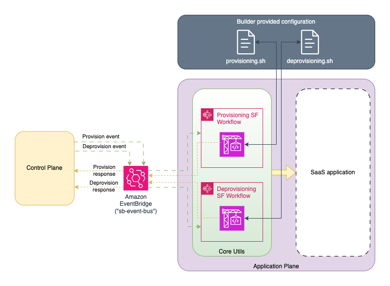

# SaaS Builder Toolkit 이란?

SaaS Builder Toolkit(SBT) 개발자 가이드에 오신 것을 환영합니다. 이 문서에서는 SBT에 대한 소개와 이를 사용하여 SaaS 애플리케이션 개발을 가속화하는 방법을 설명합니다. 

SBT는 관심 있는 AWS 파트너와 협력하여 개발 중입니다. 이 프로젝트는 [GitHub에 오픈 소스](https://github.com/awslabs/sbt-aws)로 제공됩니다. SBT에 기여하는 방법은 프로젝트 루트의 [Contributing](/CONTRIBUTING.md) 문서를 참조하십시오.

## 배경

AWS에서는 파트너 및 고객 지원을 위해 해마다 수많은 리소스와 SaaS 아티팩트를 생성합니다. 구축 과정에서 이러한 아티팩트, 특히 레퍼런스 아키텍처와 일부 “특화된 솔루션”에 있어서, 동일한 패턴과 코드를 확인 할 수 있었습니다. 이러한 아티팩트 개발을 담당하는 팀에서는 하나의 솔루션에서 다른 솔루션으로 코드를 복사하는 경우가 많고, 이런 코드 복제에는 분명히 단점이 있습니다. 특히 장기 유지 관리 및 민첩성에 있어서는 단점이 매우 도드라집니다. 그러한 문제를 해결하기 위해, 우리는 이러한 중복되는 코드를 재사용 가능한 구문으로 추상화할 방법을 찾기 시작했습니다.

또한, 지난 몇 년 동안 SaaS 아키텍처 영역에서 Application Plane과 Control Plane으로 더욱 명확하게 구분하여 멀티 테넌트 아키텍처의 두 부분으로 식별했습니다. 이 접근 방식은 SaaS 솔루션을 구축할 때 해결해야 하는 책임과 서비스에 대한 경계를 제공함으로써 고객, 파트너 및 광범위한 SaaS 커뮤니티의 공감을 불러일으켰습니다. 

SBT는 이 두 가지 상황을 모두 해결하도록 설계된 프로젝트입니다. 즉, SBT의 목적은 아래와 같습니다.

* Control Plane 과 Application Plane 을 그에 상응하는 역할 및 책임에 맞게 SaaS 아키텍처에 있어서, First-Class 개념으로 식별합니다.
* 두 Plan을 각각 재사용 가능한, 구문과 추상화를 위해 코드로 일반화합니다.
* 페이로드 관점, 기대되는 동작방식 그리고 진행상태 관리를 포함하여 두 Plane 간의 메시지 흐름을 상세히 문서화합니다.
* 다양한 기술 스택과 AWS 서비스 전반에 걸처, AWS의 SaaS 모범 사례를 포함하는 프레임워크 및 구성 요소 세트를 제공합니다.

SBT가 훌륭한 멀티테넌트 아키텍처 구성에 필요한, 반복적으로 작성되는 코드 및 구성 요소의 상당 부분을 처리하거나 적어도 추상화하여 새로운 SaaS 어플리케이션의 개발 주기가 가속화 될겁니다. 개발 속도를 높일 수 있을 뿐만 아니라, 이 접근 방식의 추가적인 이점 중 하나는 SaaS 영역에서 보다 효율적이고 정확한 커뮤니케이션을 위한 공통의 패턴 및 용어를 구축할 수 있다는 것입니다.

## 대상

이 문서는 새로운 SaaS 애플리케이션을 개발하는 SaaS 빌더와 아키텍트, 또는 SBT에 대한 기여나 소스 코드, 문서와 SBT 설계에 관심이 있는 빌더를 대상으로 합니다.

## 상위 레벨의 디자인

이 섹션에서는 지금까지 언급했던 SBT의 모든 주요 요소의 제공 기능을 자세히 설명하고 새로운 개발자가 속도를 낼 수 있는 토대를 제공합니다. 분명히 SBT는 아직 개발 단계에 있으며, 거의 매일 진행하는 작업은 SBT의 설계에 영향을 줄 수 있습니다. SBT의 고도화가 진행될수록 이 문서가 SBT의 최신의 상태를 정확하게 설명할 수 있도록 많은 노력이 필요합니다.

SBT의 Concept Diagram:


다이어그램에서 왼쪽 부분은 Control Plane이 API 및 해당 API를 호출하는 클라이언트, 즉 SBT Command Line Interface(CLI) 및 필요하다면 웹 관리 콘솔 등이 제공될 수 있습니다. Control Plane의 파란색 박스는 SaaS 애플리케이션에서 흔히 볼 수 있는 여러 주요 기능을 나타냅니다.

오른쪽 부분에는 Application Plane이 표시됩니다. 설계 측면으로 보면, SBT는 대부분의 SaaS 애플리케이션을 지원할 수 있습니다. Control Plane이 보낸 메시지를 구독(Subscribe)하고 SBT에 정의된 연동 방법에 따를 수 있는 한 모든 애플리케이션에 적용될 수 있습니다. Application Plane의 녹색 박스는 개발을 지원하기 위해 SBT와 함께 제공되는 주요 기능 세트를 나타냅니다. 현재는, 이 SBT 라이브러리에는 테넌트 프로비저닝 및 디-프로비저닝을 지원하는 기능의 세트만 제공 되지만 (자세한 내용은 나중에 설명), SBT가 발전함에 따라 추가 구성 요소(녹색 박스에 표시된 점선 테두리)의 기능들로 확장해 나갈 예정입니다.

상단에 “빌더 제공 설정”이 표시됩니다. 이는 빌더가 자신의 SaaS 애플리케이션을 구축하기 위해서 설정하는 데이터 및 메타데이터입니다. 예를 들어, 여기서는 새 테넌트를 프로비저닝하기 위한 구성을 찾을 수 있을 것으로 예상됩니다. ID 및 권한 부여 구성도 찾을 수 있습니다.

두 영역의 중간에는 아마존 EventBridge가 있다는 것을 알 수 있습니다. EventBridge는 이벤트 기반 애플리케이션을 대규모로 구축하는 데 사용되는 Serverless 이벤트 버스입니다. SBT는 각 Plane에서 SaaS 워크플로우와 관련된 메시지를 게시(Publish)하고 해당 메시지를 구독(Subscribe)할 수 있는 기능을 제공합니다. 이러한 메시지의 형태 및 데이터/흐름에 대한 설명은 이 문서의 [인터페이스 정의](#interface-definitions) 섹션에 자세히 설명되어 있습니다.

## 빌더 경험
SBT의 구성 요소를 자세히 설명하기 전에 먼저 SBT가 원하는 사용자 경험에 대해 논의해보고 싶습니다. SBT는 AWS CDK(Cloud Development Kit)를 광범위하게 사용하고 CDK의 CPM(Construct Programming Model) 방식을 준수합니다. 이 모든 것이 무엇을 의미하는지, 설명하는 것보다 보여주는 것이 더 쉬울 수도 있습니다. 다음 예는 [CDK의 시작하기 문서](https://docs.aws.amazon.com/cdk/v2/guide/home.html#why_use_cdk)에서 바로 가져온 것입니다.

### CDK Example

```typescript
export class MyEcsConstructStack extends Stack {
  constructor(scope: App, id: string, props?: StackProps) {
    super(scope, id, props);

    const vpc = new ec2.Vpc(this, "MyVpc", {
      maxAzs: 3 // Default is all AZs in region
    });

    const cluster = new ecs.Cluster(this, "MyCluster", {
      vpc: vpc
    });

    // Create a load-balanced Fargate service and make it public
    new ecs_patterns.ApplicationLoadBalancedFargateService(this, "MyFargateService", {
      cluster: cluster, // Required
      cpu: 512, // Default is 256
      desiredCount: 6, // Default is 1
      taskImageOptions: { image: ecs.ContainerImage.fromRegistry("amazon/amazon-ecs-sample") },
      memoryLimitMiB: 2048, // Default is 512
      publicLoadBalancer: true // Default is false
    });
  }
}
```

Typescript에 익숙하지 않더라도 코드를 보면 쉽게 이해할 수 있을 것입니다. 간단히 살펴보면, 이 코드는 새로 생성된 VPC 내부에 서비스로 래핑된 로드 밸런싱된 Fargate 태스크를 사용하여 ECS 클러스터를 생성합니다. CDK의 "Synthesizing" 프로세스를 통해서 이 몇 줄의 Typescript 코드는 500줄 이상의 CloudFormation으로 표현되는 것을 확인할 수 있습니다.

이 예제에 있는 “Object”들은 CDK 팀에서 작성했습니다. 구체적으로는 `VPC`, `ECS 클러스터`, `ApplicationLoadBalancedFargateService` Object가 있습니다. CDK는 이러한 Object를 “Constructs”라고 부릅니다. CDK는 기본적으로 Constructs을 개발할 수 있는 도구와 추상화를 제공합니다. 일부 Constructs에는 CloudFormation 형식과의 1:1 매핑이 됩니다. 그 외에 많은 다양한 Constructs가 있습니다 (예: 위와 같은 ECS 서비스).

### 튜토리얼

앞서 언급했듯이 SBT는 CDK를 이용하여 구축되었습니다. 사용법을 설명하려면 먼저 CDK 시작 가이드를 따라 새 CDK 응용 프로그램을 초기화하세요. 가이드는 [여기](https://docs.aws.amazon.com/cdk/v2/guide/hello_world.html#hello_world_tutorial_create_app)에서 찾을 수 있습니다. **hello cdk** 튜토리얼의 1단계를 완료한 후 여기로 돌아와 SBT를 계속 진행하세요. 다시 말하지만, 샘플 앱을 빌드하거나 배포할 필요가 없습니다. 지금은 그냥 만들어 보세요.

이제, 새 CDK 앱을 초기화했으므로 SBT 구성 요소를 설치해 보겠습니다. `hello-cdk` 디렉터리 로 이동해서 다음 명령을 실행하세요.

```sh
npm install @cdklabs/sbt-aws
```

#### Control Plane

SBT 패키지가 설치되었으므로 새 SBT Control Plane을 생성해 보겠습니다. 다음 내용으로 `/lib/control-plane.ts` 아래에 새 파일을 만듭니다. 임시 관리자 비밀번호를 받을 수 있는 곳이므로 이메일 주소를 실제 이메일로 바꾸십시오.

```typescript
import * as sbt from '@cdklabs/sbt-aws';
import { Stack } from 'aws-cdk-lib';
import { Construct } from 'constructs';

export class ControlPlaneStack extends Stack {
  public readonly regApiGatewayUrl: string;
  public readonly eventBusArn: string;

  constructor(scope: Construct, id: string, props?: any) {
    super(scope, id, props);
    const cognitoAuth = new sbt.CognitoAuth(this, 'CognitoAuth', {
      // Avoid checking scopes for API endpoints. Done only for testing purposes.
      setAPIGWScopes: false,
    });

    const controlPlane = new sbt.ControlPlane(this, 'ControlPlane', {
      auth: cognitoAuth,
      systemAdminEmail: 'ENTER YOUR EMAIL HERE',
    });

    this.eventBusArn = controlPlane.eventManager.busArn;
    this.regApiGatewayUrl = controlPlane.controlPlaneAPIGatewayUrl;
  }
}
```

여기서 "ControlPlaneStack"이라는 새로운 [CDK 스택](https://docs.aws.amazon.com/cdk/v2/guide/stacks.html)을 생성하고 있습니다. 해당 스택에서는 `@cdklabs/sbt-aws` 패키지에서 가져온 `ControlPlane` Construct을 생성합니다.

주의깊게 봐야 하는 또 다른 중요한 개념은 플러그 방식의 접근입니다. "CognitoAuth"라는 “auth” 컴포넌트를 생성하고 있다는 점에 주목해야 합니다. 이 컴포넌트는 SBT 코어 패키지에 정의된 [`IAuth`](/API.md#iauth-) 인터페이스를 구현합니다. 현재 `IAuth`의 Cognito 구현했지만, 기술적으로 모든 Identity Provider를 이용하여 해당 인터페이스를 구현할 수 있습니다.

##### Build it

이제 이 구성 요소를 빌드하고 배포해 보겠습니다. 그 전에 파일을 하나 더 수정해야 합니다.`bin` 디렉터리에 있는 `hello-cdk.ts` 파일을 열고, 그 안에 있는 모든 내용을 다음 내용으로 변경합니다.

```typescript
#!/usr/bin/env node
import 'source-map-support/register';
import * as cdk from 'aws-cdk-lib';
import { ControlPlaneStack } from '../lib/control-plane';
// import { AppPlaneStack } from '../lib/app-plane';

const app = new cdk.App();
const controlPlaneStack = new ControlPlaneStack(app, 'ControlPlaneStack');
// const appPlaneStack = new AppPlaneStack(app, 'AppPlaneStack', {
//   eventBusArn: controlPlaneStack.eventBusArn,
// });
```

여기에서는 몇 줄을 주석처리 했습니다. 나중에 Application Plane을 적용할 때 이 부분에 대해서 다시 설명하겠습니다. 모든 내용이 저장되었는지 확인한 후, `hello-cdk` 프로젝트의 루트 경로에서 다음을 실행합니다.

> [!WARNING]  
> Control Plane은 Lambda 함수들을 배포하므로 이 CDK 스택을 빌드하고 배포하려면 Docker를 설치해야 합니다.
>

```sh
npm run build
cdk bootstrap
cdk deploy ControlPlaneStack
```

이렇게 하면 CDK 애플리케이션을 AWS CloudFormation으로 합성한 다음 해당 CloudFormation을 배포할 수 있습니다. 위의 명령어를 통해 AWS Cloud 리소스를 생성하기 위해 내부적으로 많은 프로세스가 진행됩니다. 이 Construct는 새로운 API Gateway 구성 요소를 사용하여 Control Plane의 API를 제공할 뿐만 아니라 테넌트 프로비저닝 및 관리에 사용되는 여러 서비스를 AWS Lambda 함수로 배포합니다.

AWS 콘솔을 열고 다음 내용을 살펴보시기 바랍니다 (배포한 Region 확인).

* [AWS Lambda](https://console.aws.amazon.com/lambda/home)
* [Amazon Cognito](https://console.aws.amazon.com/cognito/v2/idp/user-pools)
* [API Gateway](https://console.aws.amazon.com/apigateway/main/apis)

작업이 완료되면, 이제 개념적 [다이어그램](#high-level-design)의 왼쪽 부분이 배포되었고 몇 개의 Construct로 이 작업을 수행했습니다. 여기서, Control Plane의 API가 배포되었고, 또한 EventBridge에도 연결했습니다. 다음으로는, Application Plane 을 배포하고 동일한 EventBridge 버스에 연결하여 해당 Control Plane의 생성한 Event를 처리 할 수 있도록 하겠습니다.

#### Application Plane

앞서 언급했듯이, SBT는 배포하려는 애플리케이션에 대해 종속되지 않습니다. 따라서 `ApplicationPlane`은 CDK 구문을 구분하여 만들어 애플리케이션을 정의하고 구현해야 합니다. 다음과 같은 간단한 예(작동하지 않는)를 들어보겠습니다.

```typescript
export interface AppPlaneProps extends cdk.StackProps {
  eventBusArn: string;
}

export class ApplicationPlaneStack extends Stack {
  constructor(scope: Construct, id: string, props: AppPlaneProps) {
    super(scope, id, props);

    const eventBus = EventBus.fromEventBusArn(this, 'EventBus', props.eventBusArn);
    const eventManager = new sbt.EventManager(this, 'EventManager', {
      eventBus: eventBus,
    });
    new sbt.CoreApplicationPlane(this, 'CoreApplicationPlane', {
      eventManager: eventManager,
      jobRunnerPropsList: [],
    });
  }
}
```

여기서, SBT의 Application Plane을 생성하고 Control Plane에서 사용한 것과 동일한 EventBus를 사용하여 생성된 EventManager를 전달합니다. 이렇게 하면 두 Plane이 모두 Amazon EventBridge의 동일한 이벤트에 연결됩니다.

이 예제에는 EventBridge 이벤트 구독(Subscribe)과 해당 구독에 따른 동작이 누락되었습니다. Application Plane 개발자인 경우, Control Plane이 게시(Publish)한 다양한 이벤트에 리스너를 연결하고 이벤트에 요청된 작업을 수행합니다. 예를 들어, Control Plane이 온보딩 이벤트를 전송하면, Application Plane이 새 테넌트 리소스를 프로비저닝 할 수 있도록 합니다. 이 때 전송되는 이벤트의 페이로드에는 Application Plane이 작업을 완료하는 데 필요한 정보가 포함되어야 합니다. 완료되면 Application Plane에서 성공 또는 실패를 나타내는 상태 이벤트를 다시 전송하도록 합니다.

다시 말하지만, SBT를 사용하면 빌더가 직접 EventBridge에 게시(Publish)하고 구독(Subscribe)할 수 있으며 해당 프로세스를 목적에 맞게 처리할 수 있습니다. 하지만 아직, SBT 라이브러리의 일부로써 전형적인 Application Plane 워크플로를 지원하는 유틸리티 세트만 게시했습니다. 이제 이러한 유틸리티 중 하나를 살펴보겠습니다. 학습 후, 이 코드에 우리가 배운 내용으로 완성해 보겠습니다.

#### Core Application Plane 유틸리티

전적으로 선택 사항이긴 하지만 SBT에는 Control Plane 메시지를 받았을 때 `JobRunner`라는 임의의 작업을 정의하고 실행할 수 있는 유틸리티가 포함되어 있습니다. 이는 현재 SBT로 포팅된 참조 아키텍처의 온보딩 및 오프보딩에 사용되는 메커니즘입니다(이 문서 끝부분 참조). 바로 그 테넌트의 provisioning/deprovisioning 프로세스는 다음과 같습니다.



위에서, `provisioning.sh` 및 `deprovisioning.sh` 스크립트가 사용되는 것을 볼 수 있습니다. 이 스크립트는 `JobRunner`에 파라미터로 전달됩니다. 내부적으로 `JobRunner`는 AWS Step Function 내부에서 래핑된 AWS CodeBuild 프로젝트를 시작하여 bash 스크립트를 실행합니다. 또한 `JobRunner`를 사용하면 스크립트에 공급할 입력 변수와 함께 반환할 출력 변수를 지정할 수 있습니다. 참고로 이 버전의 SBT에서는 `jobRunnerPropsList` 입력값 (위 코드의 빈 배열)을 기반으로 `CoreAppPlane`이 `JobRunner`에 의해 생성된다는 점을 명심해야 합니다. 여기서 객체 타입은 [`jobRunnerProps`](/API.md#coreapplicationplanejobrunnerprops-)입니다. 간단한 예를 들어보겠습니다. 테넌트당 하나의 S3 버킷만 배포하는 SaaS 애플리케이션이 있다고 가정해 보겠습니다. 이제 해당 프로비저닝을 위한 Job Runner를 만들어 보겠습니다.

```typescript
const provisioningJobRunnerProps = {
  name: 'provisioning',
  permissions: PolicyDocument.fromJson(/*See below*/),
  script: '' /*See below*/,
  environmentStringVariablesFromIncomingEvent: ['tenantId', 'tier'],
  environmentVariablesToOutgoingEvent: ['tenantS3Bucket', 'someOtherVariable', 'tenantConfig'],
  scriptEnvironmentVariables: {
    TEST: 'test',
  },
  outgoingEvent: sbt.DetailType.PROVISION_SUCCESS,
  incomingEvent: sbt.DetailType.ONBOARDING_REQUEST,
};
```

##### Bash Job Runner 프로퍼티

잠시 이 객체를 자세히 살펴보겠습니다.

| Key                                             | Type                                                                                                  | Purpose                                                                                               |
| ----------------------------------------------- | ----------------------------------------------------------------------------------------------------- | ----------------------------------------------------------------------------------------------------- |
| **name**                                        | string                                                                                                | The **name** key is just a name for this job.                                                         |
| **script**                                      | string                                                                                                | A string in bash script format that represents the job to be run (example below)                      |
| **permissions**                                 | [PolicyDocument](https://docs.aws.amazon.com/cdk/api/v2/docs/aws-cdk-lib.aws_iam.PolicyDocument.html) | An IAM policy document giving this job the IAM permisisons it needs to do what it's being asked to do |
| **environmentStringVariablesFromIncomingEvent** | string[]                                                                                              | The environment variables to import into the BashJobRunner from event details field.                  |
| **environmentVariablesToOutgoingEvent**         | string[]                                                                                              | The environment variables to export into the outgoing event once the BashJobRunner has finished.      |
| **scriptEnvironmentVariables**                  | `{ [key: string]: string }`                                                                           | The variables to pass into the codebuild BashJobRunner.                                               |
| **outgoingEvent**                               | any                                                                                                   | Outgoing EventBridge wiring details                                                                   |
| **incomingEvent**                               | any                                                                                                   | Incoming EventBridge wiring details                                                                   |

`JobRunner`의 배치 작업으로 `script` 키의 값을 사용하여 실행합니다. 이 특별한 예시는 프로비저닝에 관한 내용입니다. 여기서의 “SaaS 애플리케이션” 예제는 단지 각 테넌트에 대해 새 S3 버킷을 프로비저닝하는 것에 불과합니다. 이제, 프로비저닝 스크립트 예제를 살펴보겠습니다.

```sh
echo "starting..."

# note that this template.json is being created here, but
# it could just as easily be pulled in from an S3 bucket.
cat > template.json << EOM
{
  "AWSTemplateFormatVersion": "2010-09-09",
  "Resources": {"MyBucket": {"Type": "AWS::S3::Bucket"}},
  "Outputs": {"S3Bucket": {"Value": { "Ref": "MyBucket" }}}
}
EOM

echo "tenantId: $tenantId"
echo "tier: $tier"

aws cloudformation create-stack --stack-name "tenantTemplateStack-\${tenantId}" --template-body "file://template.json"

aws cloudformation wait stack-create-complete --stack-name "tenantTemplateStack-\${tenantId}"

export tenantS3Bucket=$(aws cloudformation describe-stacks --stack-name "tenantTemplateStack-\${tenantId}" | jq -r '.Stacks[0].Outputs[0].OutputValue')
export someOtherVariable="this is a test"
echo $tenantS3Bucket
export tenantConfig=$(jq --arg SAAS_APP_USERPOOL_ID "MY_SAAS_APP_USERPOOL_ID" \
--arg SAAS_APP_CLIENT_ID "MY_SAAS_APP_CLIENT_ID" \
--arg API_GATEWAY_URL "MY_API_GATEWAY_URL" \
-n '{"userPoolId":$SAAS_APP_USERPOOL_ID,"appClientId":$SAAS_APP_CLIENT_ID,"apiGatewayUrl":$API_GATEWAY_URL}')

echo $tenantConfig
export tenantStatus="created"

echo "done!"
```

이 스크립트를 섹션별로 자세히 살펴보겠습니다. 

---

###### CloudFormation 템플릿
 
첫 몇 라인에는 S3 버킷이 포함된 샘플 [AWS CloudFormation](https://aws.amazon.com/cloudformation/) 템플릿이 포함되어 있습니다. 

```sh
# note that this template.json is being created here, but
# it could just as easily be pulled in from an S3 bucket.
cat > template.json << EOM
{
  "AWSTemplateFormatVersion": "2010-09-09",
  "Resources": {"MyBucket": {"Type": "AWS::S3::Bucket"}},
  "Outputs": {"S3Bucket": {"Value": { "Ref": "MyBucket" }}}
}
EOM
```

이 경우에는 스크립트와 함께 인라인으로 선언되어 있지만, 주석으로 기술한 것처럼 이 템플릿이 S3 버킷이나 CloudFormation SDK가 접근할 수 있는 다른 위치에 있을 수 있습니다.

다음으로는, CloudFormation 템플릿 아래에 `tenantId` 및 `tier` 환경 변수의 값을 반영합니다. 

---

###### Imported variables ('environmentStringVariablesFromIncomingEvent')

```sh
echo "tenantId: $tenantId"
echo "tier: $tier"
```

이 변수들이 정확히 어떻게 사용되는지 살펴보겠습니다. `JobRunner`는 내부적으로 [AWS CodeBuild](https://docs.aws.amazon.com/codebuild/latest/userguide/welcome.html) 프로젝트를 생성한다는 점을 명심해야 합니다. `JobRunner`는 CodeBuild 프로젝트를 생성할 때 제공할 환경 변수를 지정할 수 있습니다. 또한 `JobRunner` 유틸리티는 `jobRunnerProps`의 `incomingEvent` 매개변수에 지정된 기준과 일치하는 EventBridge 메시지로 활성화된다는 점도 명심해야 합니다. EventBridge를 통해 수신되는 메시지에는 발신자(여기서는 Control Plane)가 포함시킨 컨텍스트 정보를 전달하는 `detail` JSON 객체 ([참고문서](https://docs.aws.amazon.com/eventbridge/latest/userguide/eb-events-structure.html))가 있습니다. `JobRunner`는 `environmentStringVariablesFromIncomingEvent` 키의 각 키에 대해 `JobRunner`는 EventBridge 메시지의 세부 JSON 객체에서 찾은 일치하는 키 값을 추출하고 해당 값을 CodeBuild 프로젝트에 환경 변수로 제공합니다.

Control Plane이 보낸 EventBridge의 프로비저닝 메시지 샘플을 예로 들어 보겠습니다.

```json
{
  "version": "0",
  "id": "6a7e8feb-b491-4cf7-a9f1-bf3703467718",
  "detail-type": "onboardingRequest",
  "source": "controlPlaneEventSource",
  "account": "111122223333",
  "time": "2017-12-22T18:43:48Z",
  "region": "us-west-1",
  "resources": ["arn:aws:ec2:us-west-1:123456789012:instance/i-1234567890abcdef0"],
  "detail": {
    "tenantId": "e6878e03-ae2c-43ed-a863-08314487318b",
    "tier": "standard"
  }
}
```

실행 시, 위에서 적용한 스크립트는 이 메시지에 설정된 값들과 함께 `tenantId`와 `tier` 을 반영합니다.

---

###### 테넌트 CloudFormation 아티팩트 배포

다음으로, 위에서 살펴본 CloudFormation 템플릿을 이용하는 방식으로 테넌트 인프라를 배포합니다.

```sh
aws cloudformation wait stack-create-complete --stack-name "tenantTemplateStack-\${tenantId}"
```

---

###### Exported variables ('environmentVariablesToOutgoingEvent')

스크립트의 마지막 부분에서는 상태 정보가 포함된 환경변수를 설정해서 EventBridge로 메시지를 보내 Control Plane으로 메시지를 전달합니다.

```sh
export tenantS3Bucket=$(aws cloudformation describe-stacks --stack-name "tenantTemplateStack-\${tenantId}" | jq -r '.Stacks[0].Outputs[0].OutputValue')
export someOtherVariable="this is a test"
echo $tenantS3Bucket
export tenantConfig=$(jq --arg SAAS_APP_USERPOOL_ID "MY_SAAS_APP_USERPOOL_ID" \
--arg SAAS_APP_CLIENT_ID "MY_SAAS_APP_CLIENT_ID" \
--arg API_GATEWAY_URL "MY_API_GATEWAY_URL" \
-n '{"userPoolId":$SAAS_APP_USERPOOL_ID,"appClientId":$SAAS_APP_CLIENT_ID,"apiGatewayUrl":$API_GATEWAY_URL}')
echo $tenantConfig
export tenantStatus="created"
```

EventBridge에서 수신하는 메시지의 세부 변수를 환경변수에 매핑한 것과 유사하게, `JobRunner`도 거의 동일한 작업을 반대로 수행합니다. `jobRunnerProps`의 `environmentVariablesToOutgoingEvent` 섹션에 지정된 변수는 환경변수에서 추출되어 EventBridge 메시지의 세부 정보 섹션으로 다시 전송됩니다.

#### App Plane 코드정리

Application Plane의 다양한 부분의 각각 살펴보았고, 전체 내용을 정리해 보겠습니다. CDK 앱의 `/lib` 디렉터리에 다음 파일을 만들고 이름을 `app-plane.ts`로 지정합니다. 이제 해당 파일을 열고 아래의 내용을 붙여넣습니다.

```typescript
import * as sbt from '@cdklabs/sbt-aws';
import * as cdk from 'aws-cdk-lib';
import { EventBus } from 'aws-cdk-lib/aws-events';
import { PolicyDocument, PolicyStatement, Effect } from 'aws-cdk-lib/aws-iam';

export interface AppPlaneProps extends cdk.StackProps {
  eventBusArn: string;
}
export class AppPlaneStack extends cdk.Stack {
  constructor(scope: cdk.App, id: string, props: AppPlaneProps) {
    super(scope, id, props);
    const provisioningJobRunnerProps = {
      name: 'provisioning',
      permissions: new PolicyDocument({
        statements: [
          new PolicyStatement({
            actions: [
              'cloudformation:CreateStack',
              'cloudformation:DescribeStacks',
              's3:CreateBucket',
            ],
            resources: ['*'],
            effect: Effect.ALLOW,
          }),
        ],
      }),
      script: `
echo "starting..."

# note that this template.yaml is being created here, but
# it could just as easily be pulled in from an S3 bucket.
cat > template.json << EndOfMessage
{
  "AWSTemplateFormatVersion": "2010-09-09",
  "Resources": { "MyBucket":{ "Type": "AWS::S3::Bucket" }},
  "Outputs": { "S3Bucket": { "Value": { "Ref": "MyBucket" }}}
}
EndOfMessage

echo "tenantId: $tenantId"
echo "tier: $tier"

aws cloudformation create-stack --stack-name "tenantTemplateStack-\${tenantId}"  --template-body "file://template.json"
aws cloudformation wait stack-create-complete --stack-name "tenantTemplateStack-\${tenantId}"
export tenantS3Bucket=$(aws cloudformation describe-stacks --stack-name "tenantTemplateStack-\${tenantId}" | jq -r '.Stacks[0].Outputs[0].OutputValue')
export someOtherVariable="this is a test"
echo $tenantS3Bucket

export tenantConfig=$(jq --arg SAAS_APP_USERPOOL_ID "MY_SAAS_APP_USERPOOL_ID" \
--arg SAAS_APP_CLIENT_ID "MY_SAAS_APP_CLIENT_ID" \
--arg API_GATEWAY_URL "MY_API_GATEWAY_URL" \
-n '{"userPoolId":$SAAS_APP_USERPOOL_ID,"appClientId":$SAAS_APP_CLIENT_ID,"apiGatewayUrl":$API_GATEWAY_URL}')

echo $tenantConfig
export tenantStatus="created"

echo "done!"
`,
      environmentStringVariablesFromIncomingEvent: ['tenantId', 'tier'],
      environmentVariablesToOutgoingEvent: [
        'tenantS3Bucket',
        'someOtherVariable',
        'tenantConfig',
        'tenantStatus',
      ],
      scriptEnvironmentVariables: {
        TEST: 'test',
      },
      outgoingEvent: sbt.DetailType.PROVISION_SUCCESS,
      incomingEvent: sbt.DetailType.ONBOARDING_REQUEST,
    };

    const eventBus = EventBus.fromEventBusArn(this, 'EventBus', props.eventBusArn);
    const eventManager = new sbt.EventManager(this, 'EventManager', {
      eventBus: eventBus,
    });

    new sbt.CoreApplicationPlane(this, 'CoreApplicationPlane', {
      eventManager: eventManager,
      jobRunnerPropsList: [provisioningJobRunnerProps],
    });
  }
}
```

여기에 코드가 길지만 다양한 구성이 전송된 단일 Construct일 뿐입니다. App Plane을 정의했으니 이제 CDK 앱의 `bin` 디렉터리에 있는 `hello-cdk.ts` 파일을 다시 열어 보겠습니다. 파일을 연 후에는 주석이 달린 각 줄의 주석을 제거해줍니다. 최종 파일은 다음과 같습니다.

```typescript
#!/usr/bin/env node
import 'source-map-support/register';
import * as cdk from 'aws-cdk-lib';
import { ControlPlaneStack } from '../lib/control-plane';
import { AppPlaneStack } from '../lib/app-plane';

const app = new cdk.App();
const controlPlaneStack = new ControlPlaneStack(app, 'ControlPlaneStack');
const appPlaneStack = new AppPlaneStack(app, 'AppPlaneStack', {
  eventBusArn: controlPlaneStack.eventBusArn,
});
```

Application Plane이 포함된 모든 파일이 저장되었는지 확인하고 솔루션을 다시 배포합니다.

```sh
npm run build
cdk deploy ControlPlaneStack AppPlaneStack
```

##### 배포 테스트

배포가 완료되면 몇 가지 테스트를 실행하여 기본 Control Plane과 Application Plane이 작동하는지 확인합니다. Control Plane을 배포했을 때 관리자의 임시 자격 증명이 포함된 이메일을 받게 됩니다. 다음으로, 자격 증명을 사용하여 해당 계정에 로그인 합니다. 아래 스크립트에서 다음 ('INSERT PASSWORD HERE') 부분을 임시 암호로 변경합니다. 로그인하면 이 스크립트는 새 테넌트를 온보딩하고 세부 정보를 검색합니다. 참고로 이 스크립트는 [`jq` JSON processor](https://jqlang.github.io/jq/) 를 사용합니다.

```sh
PASSWORD="INSERT PASSWORD HERE"
# Change this to a real email if you'd like to log into the tenant
TENANT_EMAIL="tenant@example.com" 
CONTROL_PLANE_STACK_NAME="ControlPlaneStack"
TENANT_NAME="tenant$RANDOM"

CLIENT_ID=$(aws cloudformation describe-stacks \
  --stack-name "$CONTROL_PLANE_STACK_NAME" \
  --query "Stacks[0].Outputs[?OutputKey=='ControlPlaneIdpClientId'].OutputValue" \
  --output text)

USER_POOL_ID=$(aws cloudformation describe-stacks \
  --stack-name "$CONTROL_PLANE_STACK_NAME" \
  --query "Stacks[0].Outputs[?OutputKey=='ControlPlaneIdpUserPoolId'].OutputValue" \
  --output text)

USER="admin"

# required in order to initiate-auth
aws cognito-idp update-user-pool-client \
    --user-pool-id "$USER_POOL_ID" \
    --client-id "$CLIENT_ID" \
    --explicit-auth-flows USER_PASSWORD_AUTH

# remove need for password reset
aws cognito-idp admin-set-user-password \
    --user-pool-id "$USER_POOL_ID" \
    --username "$USER" \
    --password "$PASSWORD" \
    --permanent

# get credentials for user
AUTHENTICATION_RESULT=$(aws cognito-idp initiate-auth \
  --auth-flow USER_PASSWORD_AUTH \
  --client-id "${CLIENT_ID}" \
  --auth-parameters "USERNAME='${USER}',PASSWORD='${PASSWORD}'" \
  --query 'AuthenticationResult')

ACCESS_TOKEN=$(echo "$AUTHENTICATION_RESULT" | jq -r '.AccessToken')

CONTROL_PLANE_API_ENDPOINT=$(aws cloudformation describe-stacks \
    --stack-name "$CONTROL_PLANE_STACK_NAME" \
    --query "Stacks[0].Outputs[?contains(OutputKey,'controlPlaneAPIEndpoint')].OutputValue" \
    --output text)

DATA=$(jq --null-input \
    --arg tenantName "$TENANT_NAME" \
    --arg tenantEmail "$TENANT_EMAIL" \
    '{
  "tenantName": $tenantName,
  "email": $tenantEmail,
  "tier": "basic",
  "tenantStatus": "In progress"
}')

echo "creating tenant..."
curl --request POST \
    --url "${CONTROL_PLANE_API_ENDPOINT}tenants" \
    --header "Authorization: Bearer ${ACCESS_TOKEN}" \
    --header 'content-type: application/json' \
    --data "$DATA" | jq
echo "" # add newline

echo "retrieving tenants..."
curl --request GET \
    --url "${CONTROL_PLANE_API_ENDPOINT}tenants" \
    --header "Authorization: Bearer ${ACCESS_TOKEN}" \
    --silent | jq
```

이제 테넌트를 온보딩했으니 콘솔을 통해서 어떤 리소스들이 배포되었는지 살펴보겠습니다.

먼저 [DynamoDB Console](https://console.aws.amazon.com/dynamodbv2/home#)을 열어 보겠습니다. 화면에서 왼쪽의 `Explore Items` 링크를 클릭합니다. `Tables` 화면에서 `ControlPlaneStack` 시작하는 테이블명을 선택합니다. 방금 온보딩한 테넌트에 대한 데이터를 확인할 수 있습니다. 하지만, 아직 “in progress” 상태일 수도 있습니다.

이전에, Application Plane과 함께 `JobRunner`를 배포했었습니다. 이는 CodeBuild를 통해 프로비저닝 스크립트를 실행하는 AWS Step Function을 감싸는 래퍼입니다. 이제 [Step Functions in the console](https://console.aws.amazon.com/states/home)로 이동하여 해당 Step Functions를 살펴보겠습니다(배포한 Region과 동일한 Region에 있는지 확인).

Step Function이 아직 실행 중일 가능성이 높은데, 그런 경우에는 실행 상태를 살펴보는 것도 나쁘지 않습니다. 완료되면 결과를 EventBridge로 다시 반환하고 Control Plane을 사용하여 루프를 닫습니다.

## 인터페이스 정의

이 섹션에서는 메시지 페이로드에 대한 간단한 설명과 함께 두 Plane 간에 전달되는 EventBridge 메시지를 자세히 설명합니다.

### 이벤트 개요

#### 테넌트 온보딩 요청

Control Plane은 새 테넌트를 온보딩할 때마다 이 이벤트를 발생시킵니다. 이 이벤트에는 테넌트 관리 서비스에서 추가한 일부 필드와 함께 테넌트 생성 요청(POST /tenants)에 있는 모든 정보가 포함되어 있습니다. 위의 경우 온보딩 이벤트는 다음과 같습니다.

##### 온보딩 요청 이벤트 샘플

```json
{
  "source": "controlPlaneEventSource",
  "detail-type": "onboardingRequest",
  "detail": {
    "tenantId": "guid string",
    "tenantName": "tenant$RANDOM",
    "email": "tenant@example.com",
    "tier": "basic",
    "tenantStatus": "In progress"
  }
}
```

#### 테넌트 프로비전 성공

구성에 따라 Application Plane은 온보딩이 완료되면 이 이벤트를 발생시킵니다. 여기에는 `tenantId`와 `environmentVariablesToOutgoingEvent` 매개변수에서 키가 식별된 환경 변수(key/value 쌍)가 포함된 `tenantOutput` 개체가 포함되어 있습니다. 위의 예에서 프로비전 성공 이벤트는 다음과 같습니다.

##### 프로비전 성공 이벤트 샘플

```json
{
  "source": "applicationPlaneEventSource",
  "detail-type": "provisionSuccess",
  "detail": {
    "tenantOutput": {
      "tenantStatus": "created",
      "tenantConfig": "{\n  \"userPoolId\": \"MY_SAAS_APP_USERPOOL_ID\",\n  \"appClientId\": \"MY_SAAS_APP_CLIENT_ID\",\n  \"apiGatewayUrl\": \"MY_API_GATEWAY_URL\"\n}",
      "tenantName": "tenant$RANDOM",
      "tenantS3Bucket": "mybucket",
      "someOtherVariable": "this is a test",
      "email": "tenant@example.com"
    },
    "tenantId": "guid string"
  }
}
```

#### 테넌트 오프보딩 요청

Control Plane은 테넌트를 오프보딩할 때마다 이 이벤트를 발생시킵니다. 이 이벤트에는 반드시 테넌트 ID가 포함되고 필요하다면 Tier 정보가 포함될 수 있습니다. 오프보딩은 테넌트의 사용자가 시스템 접속을 막고, SBT에서 해당 테넌트 인프라를 삭제합니다.
Control Plane은 테넌트를 오프보딩할 때마다 이 이벤트를 내보냅니다. 이 이벤트의 세부정보에는 전체 테넌트 개체(예: `tenantId`와 같은 필드와 함께 테넌트 생성 요청에 정의된 필드)가 포함됩니다. 위에 정의된 온보딩 작업과 유사하게 오프보딩은 테넌트의 전용 인프라 삭제를 포함하되 이에 국한되지 않고 애플리케이션에 필요한 모든 것이 될 수 있습니다.

##### 오프보딩 요청 이벤트 샘플

```json
{
  "source": "controlPlaneEventSource",
  "detail-type": "offboardingRequest",
  "detail": {
    // <entire tenant object>
  }
}
```

#### 테넌트 디프로비저닝 성공

Application Plane은 오프보딩이 완료되면 이 이벤트를 내보냅니다. 프로비저닝 성공 이벤트와 유사하게 해당 내용은 `environmentVariablesToOutgoingEvent` 매개변수의 키로 식별되는 환경 변수에 의해 결정됩니다.

##### 디프로비저닝 성공 이벤트 샘플

```json
{
  "source": "applicationPlaneEventSource",
  "detail-type": "deprovisionSuccess",
  "detail": {
    "tenantOutput": {
      // defined in the deprovisioning job configuration
    },
    "tenantId": "guid string"
  }
}
```

## 디자인 원칙

- **모범 사례 SaaS 애플리케이션 제작을 위한 템플릿 모델** - SBT는 모든 SaaS 애플리케이션을 구축할 수 있는 멘탈 모델과 기본 구현을 제공하기 위해 노력합니다.
- **강력한 SaaS 촉진** - Control Plane과 Application Plane 라이브러리의 기능과 경험은 SaaS 빌더가 이를 SaaS로의 경로를 표준화, 단순화 및 가속화하는 데 사용하도록 동기를 부여할 만큼 충분히 강력해야 합니다.
- **독립적인 설계** - SBT의 두 Plane은 상호 보완적이지만 서로 연결되어 있지는 않습니다. 둘을 함께 사용하는 것이 더 좋지만 SBT는 서로 분리되어 독립적으로 배치하고 운영할 수 있도록 설계되었으며 빌더는 해당 용도에 적합한 부분을 선택할 수 있습니다.
- **지속적인 혁신의 방향 유지 및 가치 추구** - SaaS 빌더의 지속적인 혁신과 생산성을 유지합니다. 합리적인 지침과 추상화를 통해 SaaS 솔루션 구현에 영향을 주며 발전을 지속합니다.
- **오픈 커뮤니티와 함께 성장** - SBT는 개발자들과 함께 발전해나갑니다. 우리는 Fork가 아닌 PR을 권장합니다.
- **빌더에게 쉬운 사용을 위한 가이드** - SBT는 커뮤니티가 영감을 얻고, 참고 자료를 사용할 수 있는 풍부한 문서와 예제를 제공합니다.

## 추가 문서 및 리소스

### 테넌트 관리

현재, 이 서비스는 Application Plane에 온보딩 처리를 요청하고, 그 처리된 결과를 저장하며, 잘 동작됨을 확인할 수 있습니다. SBT 모델에서 기본 참조 아키텍처를 계속 구축함에 따라 테넌트 구성, 라우팅 또는 ID와 같은 추가 기능의 필요성을 파악할 수 있습니다.

### 시스템 사용자 관리

시스템 사용자는 SaaS 서비스를 관리하는 관리자를 나타냅니다. 이러한 관리자는 SaaS 환경을 관리하기 위한 여러 사용자를 인증하고 관리하는 데 사용할 수 있는 고유한 ID 메커니즘이 있어야 합니다. 이러한 관리자의 특성과 라이프사이클은 테넌트 사용자보다 훨씬 간단합니다. 이러한 관리자는 Control Plane이 제공하는 환경을 이용해서 서비스를 관리합니다. 따라서 사용자 설정이 간단하며, Control Plane의 기본 도구/콘솔을 통해서 액세스할 수 있습니다.  

### 테넌트 사용자 관리

모든 SaaS 시스템에는 해당 시스템의 사용자를 관리할 방법이 필요합니다.이러한 사용자는 Application Plane 범위 내에서 완전히 관리될 수 있습니다. 그러나 이러한 일반 사용자는 온보딩 및 인증 과정의 일부로 테넌트에도 연결되어야 합니다. 따라서 테넌트를 ID에 연결해야 하므로 Control Plane 범위 내에서 테넌트 사용자를 저장하고 관리해야 합니다. 이를 통해 Control Plane 내에서 훨씬 높은 수준의 자동화가 가능해져 사용자를 테넌트에 연결하고, 테넌트 컨텍스트로 사용자를 인증하고, 테넌트 컨텍스트를 Application Plane에 주입하는 모든 메커니즘을 사용할 수 있습니다. 그러나 Control Plane에서 테넌트 사용자 관리를 호스팅하는 경우 이 서비스는 다양한 환경의 테넌트 사용자와 관련된 추가 속성을 관리하는 추가 책임을 맡아야 합니다. 따라서 서비스형 Control Plane은 빌더가 테넌트 사용자 구성을 더 잘 제어할 수 있도록 유연성과 사용자 지정을 향상시켜야 합니다. 실제로 Application Plane에는 이 테넌트 관리 서비스와 통합하여 테넌트 사용자를 관리/구성하는 사용자 경험이 포함될 수 있습니다.

### 온보딩

테넌트 온보딩의 전체 라이프사이클을 관리하는 것은 Control Plane의 가장 중요한 역할 중 하나입니다. 이 서비스는 새 테넌트 추가와 관련된 모든 설정 및 다운스트림 이벤트를 조정하는 역할을 담당합니다. 따라서 여기서는 테넌트 관리 및 테넌트의 사용자 관리의 상호 작용을 확인할 수 있습니다. 이제 온보딩이 어떻게 Application Plane과 통합하고 그 의존성을 살펴보면 온보딩은 더욱 흥미로워집니다. 새 테넌트들이 Control Plane을 통해 온보딩되므로 Control Plane은 Application Plane에 이벤트를 전송하여 테넌트별로 필요한 리소스/인프라의 생성을 Application Plane에 트리거해야 합니다. 온보딩 서비스는 이 애플리케이션 프로비저닝 이벤트를 게시하고 Application Plane의 테넌트 프로비저닝 라이프사이클의 진행 상황을 나타내는 다양한 이벤트를 수신해야 합니다.

### 빌링

많은 SaaS 제공업체는 Tier 및 수익 창출 전략에 맞는 빌링 플랜을 만들 수 있는 빌링 서비스와의 통합을 활용합니다. 일반적으로 이러한 접근 방식은 Control Plane 내에 API를 제공하여 빌링 계정을 생성(온보딩) 하고 개별 테넌트에 대한 빌링/소비 이벤트를 게시하는 범용 메커니즘을 제공하는 것입니다. 이 서비스에는 테넌트 관리와의 통합도 포함되어 있어 테넌트 상태 이벤트를 빌링 서비스 간에 전송할 수 있습니다. 예를 들어, 비활성화된 테넌트는 빌링에서 테넌트 관리까지 트리거될 수 있습니다. Tier 변경도 이 통합의 일부일 수 있습니다.   

### 메트릭

멀티 테넌트 운영 팀은 Tier에 기반한 테넌트의 동작 및 사용패턴에 대한 프로필을 통해 테넌트 인식에 대한 통찰력이 필요한 경우가 많습니다. 이 데이터는 다양한 상황에서 사용되므로 팀은 애플리케이션 계층에서 게시한 메트릭을 통해 관찰할 수 있는 테넌트 인식 패턴을 기반으로 운영, 비즈니스 및 설계 결정을 내릴 수 있습니다. Control Plane은 이러한 메트릭 이벤트를 수집하는 데 사용할 표준화된 메트릭 API를 제공합니다. 또한 빌더는 이를 통해 테넌트 및 Tier 컨텍스트가 이러한 이벤트를 통해 전달되는 방식을 일부 표준화하여 커스텀 이벤트를 정의할 수 있습니다. 이러한 메트릭은 모두 컨트롤 플레인에 의해 집계되고 Control Plane 관리 콘솔의 대시보드를 통해 표시됩니다. 지표 데이터를 다른 분석 도구에 수집하는 기능도 지원될 수 있습니다.

### Tiering
Tier는 Control Plane의 완전히 기본이 되는 구조입니다. 하지만, SaaS 환경의 Tier 구성을 위한 범용적이고 중앙 집중식인 구조를 제공을 위해 반드시 필요합니다. 이를 통해 Application Plane과 Control Plane 간의 조정 위치가 정해지고, Control Plane 내부 및 외부의 여러 사용자 경험을 제공하는 Tier에 테넌트를 명확하게 매핑할 수 있습니다.

### AWS Marketplace 통합

SaaS Builder Toolkit은 SaaS 애플리케이션과 AWS Marketplace의 통합을 단순화하기 위한 Construct을 제공합니다. `AWSMarketplaceSaaSProduct` Construct을 사용하면 등록 API, 구독자 정보 저장을 위한 DynamoDB 테이블, 구독 및 자격 부여 이벤트 처리에 필요한 AWS Lambda 함수 및 이벤트 소스를 포함하여 AWS Marketplace SaaS 제품을 생성할 수 있습니다.

Toolkit에는 Amazon S3에서 호스팅되고 Amazon CloudFront가 앞에 있는 샘플 등록 웹 페이지를 생성하는 `SampleRegistrationWebPage` Construct도 포함되어 있습니다. 웹 페이지에는 사용자가 SaaS 제품에 등록할 수 있는 동적 양식이 포함되어 있으며 등록에 필요한 필수 필드가 Construct에 대한 소품으로 지정되어 있습니다.

또한 이 Toolkit에는 AWS Marketplace의 구독 이벤트 처리, 사용량 측정, 구독 상태에 따라 제품에 대한 액세스 권한 부여 또는 취소 등 권한 및 구독 로직을 관리하기 위한 유틸리티를 제공합니다.

이러한 Construct 및 유틸리티를 활용하면 SaaS 애플리케이션을 AWS Marketplace와 통합하는 프로세스를 간소화하여 Marketplace 요구 사항을 준수하고 고객에게 원활한 등록 및 구독 경험을 제공할 수 있습니다.

자세한 내용은 [AWS Marketplace Integration](/docs/public/marketplace-integration.md)에서 찾을 수 있습니다.