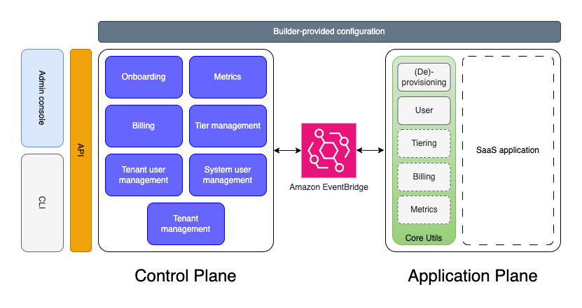

# What is the SaaS Builder Toolkit?

Welcome to the SaaS Builder Toolkit (SBT) developer guide. This document provides information about SBT, and how to use it to accelerate SaaS application development.

SBT is being developed in partnership with interested AWS partners. The project is [open sourced on GitHub](https://github.com/awslabs/sbt-aws). Please see the [contributing](/CONTRIBUTING.md) document in the project root for information on how to contribute to SBT.

## Background

At AWS, we create a number of resources and SaaS artifacts, year after year, for partner and customer enablement. In the course of building, we started to see the same patterns and bits of code showing up across these artifacts--specifically our reference architectures, and some "point solutions". Often times the teams responsible for development of these artifacts would copy code from one solution to the next, but code duplication obviously has drawbacks, particularly with long-term maintenance and agility. As a result, we started looking for ways to abstract this duplication behind reusable constructs.

Additionally, over the last few years, we’ve drawn clearer boundaries in the SaaS architecture domain, identifying the Application Plane and the Control Plane as two distinct halves of a multi-tenant architecture. This approach has resonated with customers, partners, and the broader SaaS community, providing the division of responsibilities and services that must be addressed when building a SaaS solution.

SBT is a project designed to address both of these realities. In short, SBT attempts to:

- Identify the Control and Application planes as first-class concepts in a SaaS architecture, along with their commensurate roles and responsibilities
- Codify the generalizations of each of these planes into reusable constructs and abstractions
- Establish well-documented message flows between the two planes, including payload shape, behavioral expectations, and state management
- Provide a framework and set of components that include SaaS best practices on AWS, across various technology stacks and AWS services

Our hope is that SBT accelerates the development cycle for new SaaS apps by handling, or at least abstracting, much of the boilerplate code and components that comprise good multi-tenant architectures. A side benefit of this approach is that we not only get acceleration in development, but we establish a common set of patterns, and vocabulary providing for more efficient, and precise communication in the SaaS domain.

## Intended audience

This document is intended for SaaS builders and architects creating new SaaS applications, or any builder interested in contributing to SBT, either in source code, documentation or design.

## High level design

In this section, we detail the responsibilities of all of the moving parts of SBT (as we see them today) and provide a foundation from which new developers can come up to speed. Obviously, SBT is very much still in development, and its design is being informed/influenced by tasks occurring almost daily. As our understanding here matures, we'll make every attempt to keep this documentation current and relevant.

Below is a conceptual diagram of SBT:



On the left, you'll notice the control plane along with its API and clients of that API: the SBT Command Line interface (CLI) and the (optional) web admin console. The blue boxes in the control plane represent the various coarse-grained chunks of functionality that we often see in SaaS applications.

On the right, you'll see our application plane. By design, SBT is largely unopinionated about the SaaS application it supports. So long as it can subscribe to the messages sent by the control plane, and respond according to the contracts defined in SBT, any application is supported. The green box in the application plane represents a set of utilities provided with SBT that are intended to aid in development. Currently, in this library, we have a utility to assist with tenant provisioning and de-provisioning (more on this later), but will extend this to additional components in (the dotted borders as depicted in the green box) as SBT evolves.

Along the top, you see the "builder provided configuration". This is the application-specific data and metadata that builders are expected to provide that make their application unique. In here we'd expect to find configuration for provisioning new tenants, for example. We might also find identity and authorization configuration.

In the middle, notice we have Amazon EventBridge. EventBridge is a serverless event bus used for building event-driven applications at scale. SBT provides helpers in each plane to both publish messages relevant to SaaS workflows, and subscribe to said messages. The shape and data/behavior expectations of these messages is detailed in the [Interface Definitions](#interface-definitions) section of this document.

## Builder experience

Before we describe the components of SBT in detail, we first want to discuss SBT's desired user experience. SBT makes extensive use of the AWS Cloud Development Kit (CDK), and adheres to CDK's Construct Programming Model (CPM). What does all this mean? It's probably easier to show, than to explain. The following example is lifted straight out of [CDK's Getting Started docs](https://docs.aws.amazon.com/cdk/v2/guide/home.html#why_use_cdk).

### CDK Example

```typescript
export class MyEcsConstructStack extends Stack {
  constructor(scope: App, id: string, props?: StackProps) {
    super(scope, id, props);

    const vpc = new ec2.Vpc(this, 'MyVpc', {
      maxAzs: 3, // Default is all AZs in region
    });

    const cluster = new ecs.Cluster(this, 'MyCluster', {
      vpc: vpc,
    });

    // Create a load-balanced Fargate service and make it public
    new ecs_patterns.ApplicationLoadBalancedFargateService(this, 'MyFargateService', {
      cluster: cluster, // Required
      cpu: 512, // Default is 256
      desiredCount: 6, // Default is 1
      taskImageOptions: { image: ecs.ContainerImage.fromRegistry('amazon/amazon-ecs-sample') },
      memoryLimitMiB: 2048, // Default is 512
      publicLoadBalancer: true, // Default is false
    });
  }
}
```

Even if not familiar with Typescript, you're still probably able to guess what's going on here. In short, this code is creating an ECS cluster with a load balanced Fargate task, wrapped in a service, inside a freshly created VPC. CDK is able to expand this few lines of Typescript code into more than 500 lines of CloudFormation though a process CDK calls "synthesizing".

The "objects" present in this example were written by the CDK team. Specifically, the `VPC`, `ECS Cluster`, and `ApplicationLoadBalancedFargateService`. CDK calls these objects "constructs". Under the hood, CDK provides tools and abstractions to create your own constructs. Some constructs have a 1:1 mapping with a CloudFormation type. Other constructs are much richer (the ECS Service in the above example, for instance).

### Tutorial

> [!WARNING]
> Running this tutorial may incur charges in your AWS account.

As mentioned before, SBT is built on top of CDK. To illustrate its use, please first follow the CDK getting started guide to initialize a new CDK application. You can find the guide [here](https://docs.aws.amazon.com/cdk/v2/guide/hello_world.html#hello_world_tutorial_create_app). Please complete step one of the **hello cdk** tutorial then come back here to continue with SBT. Again, you don't need to build or deploy the sample app; just create it for now.

Now that you've initialized a new CDK app, let's install the SBT components. From within the `hello-cdk` directory, please run the following command:

```sh
npm install @cdklabs/sbt-aws
```

#### Control Plane

Now that we have SBT installed, let's create a new SBT control plane. Create a new file under `/lib/control-plane.ts` with the following contents. Please be sure to replace the email address with a real email as this is where you'll get the temporary admin password.

```typescript
import * as sbt from '@cdklabs/sbt-aws';
import { Stack } from 'aws-cdk-lib';
import { Construct } from 'constructs';

export class ControlPlaneStack extends Stack {
  public readonly regApiGatewayUrl: string;
  public readonly eventManager: sbt.IEventManager;

  constructor(scope: Construct, id: string, props?: any) {
    super(scope, id, props);
    const cognitoAuth = new sbt.CognitoAuth(this, 'CognitoAuth', {
      // Avoid checking scopes for API endpoints. Done only for testing purposes.
      setAPIGWScopes: false,
    });

    const controlPlane = new sbt.ControlPlane(this, 'ControlPlane', {
      auth: cognitoAuth,
      systemAdminEmail: 'ENTER YOUR EMAIL HERE',
    });

    this.eventManager = controlPlane.eventManager;
    this.regApiGatewayUrl = controlPlane.controlPlaneAPIGatewayUrl;
  }
}
```

Notice here we're creating a new [CDK Stack](https://docs.aws.amazon.com/cdk/v2/guide/stacks.html) called "ControlPlaneStack". In that stack, we're creating a `ControlPlane` construct which we imported from the `@cdklabs/sbt-aws` package.

Another important concept worth pointing out here is the plug-ability of this approach. Notice we're creating an "auth" component, called "CognitoAuth". This component implements the [`IAuth`](/API.md#iauth-) interface defined in the SBT core package. We currently have a Cognito implementation of `IAuth`, but we could technically implement that interface with any identity provider.

##### Build it

Now let's build and deploy this component. Before we do, we have to modify one other file. Open up the `hello-cdk.ts` file in the `bin` directory, and replace everything that's in there with the following contents:

```typescript
#!/usr/bin/env node
import 'source-map-support/register';
import * as cdk from 'aws-cdk-lib';
import { ControlPlaneStack } from '../lib/control-plane';
// import { AppPlaneStack } from '../lib/app-plane';

const app = new cdk.App();
const controlPlaneStack = new ControlPlaneStack(app, 'ControlPlaneStack');
// const appPlaneStack = new AppPlaneStack(app, 'AppPlaneStack', {
//   eventManager: controlPlaneStack.eventManager,
// });
```

Notice we're leaving a few lines commented out here, we'll come back to those later when we discuss the application plane. Ensure everything is saved, then from the root of your `hello-cdk` project, run the following:

> [!WARNING]  
> Because our control plane deploys Lambda functions, you'll need Docker installed to build and deploy this CDK stack

```sh
npm run build
cdk bootstrap
cdk deploy ControlPlaneStack
```

This will kick of the synthesis of your CDK application to AWS CloudFormation, then deploy that CloudFormation. Behind the scenes, a lot is getting created. This construct not only stands up the surface of our control plane API, using a new API Gateway component, it also deploys several services as AWS Lambda functions used for tenant provisioning and management.

Feel free to open your AWS Console and take a look at the following (ensure you're in the same region you deployed to):

- [AWS Lambda](https://console.aws.amazon.com/lambda/home)
- [Amazon Cognito](https://console.aws.amazon.com/cognito/v2/idp/user-pools)
- [API Gateway](https://console.aws.amazon.com/apigateway/main/apis)

Once done, we now have the left side of our conceptual [diagram](#high-level-design) deployed, and we did it with just a few constructs. It deployed not only the API surface of our control plane, but also wired it up to EventBridge. Next, we'll start deploy the application plane, and connect it to the same EventBridge bus, so we can act upon those control plane messages.

#### Application Plane

As mentioned before, SBT is unopinionated about the application in which it's deployed. As a result, we expect you to create the `ApplicationPlane` construct as just another part of the CDK constructs that you'd use to define your application. Take this simple (non-functional) example:

```typescript
export interface AppPlaneProps extends cdk.StackProps {
  eventManager: sbt.IEventManager;
}

export class ApplicationPlaneStack extends Stack {
  constructor(scope: Construct, id: string, props: AppPlaneProps) {
    super(scope, id, props);

    new sbt.CoreApplicationPlane(this, 'CoreApplicationPlane', {
      eventManager: props.eventManager,
      scriptJobs: [],
    });
  }
}
```

In this example we're creating the application plane of SBT, and passing in an EventManager created using the same EventBus that we used in our control plane. This will ensure that both planes are wired to the same events in Amazon EventBridge.

What's missing in this example is the subscription to EventBridge events, and the acting upon those subscriptions. As an application plane developer, a builder could hook up listeners to the various events published by the control plane, and do what's asked in the event. For example, the onboarding event is sent by the control plane with the expectation that the application plane provisions new tenant resources. The event's payload should carry enough information for the application to complete its job. Once done, it's expected that the app plane sends back a status event indicating success or failure.

Again, SBT allows builders to publish and subscribe directly to EventBridge, and does not attempt to interfere with that process. However, as part of the SBT library we've published a set of utilities to assist with typical application plane workflows. Let's look one of those utilities now. Once done, we'll come back to this code and fill it in with what we learned.

#### Core Application Plane Utilities

Although entirely optional, SBT includes a utility that lets you define, and run arbitrary jobs upon receipt of a control plane message, called a `ScriptJob`. This mechanism is extended to produce two new helper constructs `ProvisioningScriptJob` and `DeprovisioningScriptJob` which are used for onboarding and off-boarding, respectively, in the reference architectures which were ported to SBT (see references at the end of this document). That tenant provisioning/deprovisioning process is depicted below:


Notice the use of the `provisioning.sh` and `deprovisioning.sh` scripts at the top. These scripts are fed to the `ProvisioningScriptJob` and `DeprovisioningScriptJob` as parameters. Internally the `ScriptJob` launches an AWS CodeBuild project, wrapped inside an AWS Step Function, to execute the bash scripts. The `ScriptJob` also lets you specify what input variables to feed to the scripts, along with what output variables you expect them to return. Note that in this version of SBT, you can create the `ScriptJob` construct with [`ScriptJobProps`](/API.md#scriptjobprops-) and configure `CoreAppPlane` with `ScriptJob`s using its `scriptJobs` property. The `CoreAppPlane` will then link these `ScriptJob`s to EventBridge. Let's take a simple example: imagine our SaaS application deployed only a single S3 bucket per tenant. Let's create a `ProvisioningScriptJob` for that provisioning now.

```typescript
const scriptJobProps: TenantLifecycleScriptJobProps = {
  permissions: PolicyDocument.fromJson(/*See below*/),
  script: '' /*See below*/,
  environmentStringVariablesFromIncomingEvent: ['tenantId', 'tier'],
  environmentVariablesToOutgoingEvent: ['tenantS3Bucket', 'someOtherVariable', 'tenantConfig'],
  scriptEnvironmentVariables: {
    TEST: 'test',
  },
  eventManager: eventManager /*See below on how to create EventManager*/,
};
```

##### ProvisioningScriptJob and DeprovisioningScriptJob Properties (TenantLifecycleScriptJobProps)

Let's take a moment and dissect this object.

| Key                                             | Type                                                                                                  | Purpose                                                                                                            |
| ----------------------------------------------- | ----------------------------------------------------------------------------------------------------- | ------------------------------------------------------------------------------------------------------------------ |
| **script**                                      | string                                                                                                | A string in bash script format that represents the job to be run (example below)                                   |
| **permissions**                                 | [PolicyDocument](https://docs.aws.amazon.com/cdk/api/v2/docs/aws-cdk-lib.aws_iam.PolicyDocument.html) | An IAM policy document giving this job the IAM permissions it needs to do what it's being asked to do              |
| **environmentStringVariablesFromIncomingEvent** | string[]                                                                                              | The environment variables to import into the ScriptJob from event details field.                                   |
| **environmentVariablesToOutgoingEvent**         | string[]                                                                                              | The environment variables to export into the outgoing event once the ScriptJob has finished.                       |
| **scriptEnvironmentVariables**                  | `{ [key: string]: string }`                                                                           | The variables to pass into the codebuild ScriptJob.                                                                |
| **eventManager**                                | [IEventManager](https://github.com/awslabs/sbt-aws/blob/main/API.md#eventmanager-)                    | The EventManager instance that allows connecting to events flowing between the Control Plane and other components. |

The heavy lifting of the `ScriptJob` construct (along with constructs that extend it like `ProvisioningScriptJob`) happens with the value of the `script` key. Let's take a look at the example provisioning script now:

```sh
echo "starting..."

# note that this template.json is being created here, but
# it could just as easily be pulled in from an S3 bucket.
cat > template.json << EOM
{
  "AWSTemplateFormatVersion": "2010-09-09",
  "Resources": {"MyBucket": {"Type": "AWS::S3::Bucket"}},
  "Outputs": {"S3Bucket": {"Value": { "Ref": "MyBucket" }}}
}
EOM

echo "tenantId: $tenantId"
echo "tier: $tier"

aws cloudformation create-stack --stack-name "tenantTemplateStack-\${tenantId}"  --template-body "file://template.json"

aws cloudformation wait stack-create-complete --stack-name "tenantTemplateStack-\${tenantId}"

export tenantS3Bucket=$(aws cloudformation describe-stacks --stack-name "tenantTemplateStack-\${tenantId}" | jq -r '.Stacks[0].Outputs[0].OutputValue')
export someOtherVariable="this is a test"
echo $tenantS3Bucket
export tenantConfig=$(jq --arg SAAS_APP_USERPOOL_ID "MY_SAAS_APP_USERPOOL_ID" \
--arg SAAS_APP_CLIENT_ID "MY_SAAS_APP_CLIENT_ID" \
--arg API_GATEWAY_URL "MY_API_GATEWAY_URL" \
-n '{"userPoolId":$SAAS_APP_USERPOOL_ID,"appClientId":$SAAS_APP_CLIENT_ID,"apiGatewayUrl":$API_GATEWAY_URL}')

echo $tenantConfig
export tenantStatus="created"

echo "done!"
```

Let's break this script down section by section.

---

###### CloudFormation template

Notice the first few lines contains a sample [AWS CloudFormation](https://aws.amazon.com/cloudformation/) template that contains our S3 Bucket.

```sh
# note that this template.json is being created here, but
# it could just as easily be pulled in from an S3 bucket.
cat > template.json << EOM
{
  "AWSTemplateFormatVersion": "2010-09-09",
  "Resources": {"MyBucket": {"Type": "AWS::S3::Bucket"}},
  "Outputs": {"S3Bucket": {"Value": { "Ref": "MyBucket" }}}
}
EOM
```

In this case we're declaring it inline with the script, but as the comment points out, there's no reason this template couldn't live in an S3 bucket, or any other place supported by the CloudFormation SDK.

Next we're echoing the value of the `tenantId` and `tier` environment variables below the CloudFormation template.

---

###### Imported variables ('environmentStringVariablesFromIncomingEvent')

```sh
echo "tenantId: $tenantId"
echo "tier: $tier"
```

Let's examine how exactly those variables get populated. Remember that the `ScriptJob` (which is used to extend the `ProvisioningScriptJob` construct) creates an [AWS CodeBuild](https://docs.aws.amazon.com/codebuild/latest/userguide/welcome.html) project internally. When the `ScriptJob` creates the CodeBuild project, it can specify what environment variables to provide. The `ScriptJob` utility is also triggered by an EventBridge message matching the criteria specified in the `incomingEvent` parameter of the `ScriptJobProps`. (You don't need to worry about doing that for `ProvisioningScriptJob` and `DeprovisioningScriptJob` because that is already configured.) The message that arrives via EventBridge has a `detail` JSON Object (see [docs here](https://docs.aws.amazon.com/eventbridge/latest/userguide/eb-events-structure.html)) that carries with it contextual information included by the sender, in our case, the control plane. For each key in the `environmentStringVariablesFromIncomingEvent` key, the `ScriptJob` extracts the value of a matching key found in the EventBridge message's detail JSON object, and provides that value to the CodeBuild project as an environment variable.

So, take for example, this sample EventBridge provisioning message sent by a control plane:

```json
{
  "version": "0",
  "id": "6a7e8feb-b491-4cf7-a9f1-bf3703467718",
  "detail-type": "onboardingRequest",
  "source": "controlPlaneEventSource",
  "account": "111122223333",
  "time": "2017-12-22T18:43:48Z",
  "region": "us-west-1",
  "resources": ["arn:aws:ec2:us-west-1:123456789012:instance/i-1234567890abcdef0"],
  "detail": {
    "tenantId": "e6878e03-ae2c-43ed-a863-08314487318b",
    "tier": "standard"
  }
}
```

When executing, the script cited above would echo both `tenantId` and `tier` with the values set according to this message.

---

###### Deploy tenant CloudFormation artifacts

Next, we're deploying tenant infrastructure by way of the CloudFormation template we saw above.

```sh
aws cloudformation wait stack-create-complete --stack-name "tenantTemplateStack-\${tenantId}"
```

---

###### Exported variables ('environmentVariablesToOutgoingEvent')

The final portion of the script exports environment variables containing information to return to the control plane via the outgoing EventBridge message.

```sh
export tenantS3Bucket=$(aws cloudformation describe-stacks --stack-name "tenantTemplateStack-\${tenantId}" | jq -r '.Stacks[0].Outputs[0].OutputValue')
export someOtherVariable="this is a test"
echo $tenantS3Bucket
export tenantConfig=$(jq --arg SAAS_APP_USERPOOL_ID "MY_SAAS_APP_USERPOOL_ID" \
--arg SAAS_APP_CLIENT_ID "MY_SAAS_APP_CLIENT_ID" \
--arg API_GATEWAY_URL "MY_API_GATEWAY_URL" \
-n '{"userPoolId":$SAAS_APP_USERPOOL_ID,"appClientId":$SAAS_APP_CLIENT_ID,"apiGatewayUrl":$API_GATEWAY_URL}')
echo $tenantConfig
export tenantStatus="created"
```

Similar to how it mapped incoming EventBridge message detail variables to environment variables, the `ScriptJob` does almost the same thing but in reverse. The variables specified in the `environmentVariablesToOutgoingEvent` section of `ScriptJobProps` will be extracted from the environment, and sent back in the EventBridge message's detail section.

#### Putting it all together

Now that we've seen the various parts of the application plane in isolation, let's put it all together. Please create the following file in the `/lib` directory of your CDK app and name it `app-plane.ts`. Now open that file and paste the following contents into it:

```typescript
import * as sbt from '@cdklabs/sbt-aws';
import * as cdk from 'aws-cdk-lib';
import { EventBus } from 'aws-cdk-lib/aws-events';
import { PolicyDocument, PolicyStatement, Effect } from 'aws-cdk-lib/aws-iam';

export interface AppPlaneProps extends cdk.StackProps {
  eventManager: sbt.IEventManager;
}
export class AppPlaneStack extends cdk.Stack {
  constructor(scope: cdk.App, id: string, props: AppPlaneProps) {
    super(scope, id, props);

    const provisioningScriptJobProps: sbt.TenantLifecycleScriptJobProps = {
      permissions: new PolicyDocument({
        statements: [
          new PolicyStatement({
            actions: [
              'cloudformation:CreateStack',
              'cloudformation:DescribeStacks',
              's3:CreateBucket',
            ],
            resources: ['*'],
            effect: Effect.ALLOW,
          }),
        ],
      }),
      script: `
echo "starting..."

# note that this template.yaml is being created here, but
# it could just as easily be pulled in from an S3 bucket.
cat > template.json << EndOfMessage
{
  "AWSTemplateFormatVersion": "2010-09-09",
  "Resources": { "MyBucket":{ "Type": "AWS::S3::Bucket" }},
  "Outputs": { "S3Bucket": { "Value": { "Ref": "MyBucket" }}}
}
EndOfMessage

echo "tenantId: $tenantId"
echo "tier: $tier"

aws cloudformation create-stack --stack-name "tenantTemplateStack-\${tenantId}"  --template-body "file://template.json"
aws cloudformation wait stack-create-complete --stack-name "tenantTemplateStack-\${tenantId}"
export tenantS3Bucket=$(aws cloudformation describe-stacks --stack-name "tenantTemplateStack-\${tenantId}" | jq -r '.Stacks[0].Outputs[0].OutputValue')
export someOtherVariable="this is a test"
echo $tenantS3Bucket

export tenantConfig=$(jq --arg SAAS_APP_USERPOOL_ID "MY_SAAS_APP_USERPOOL_ID" \
--arg SAAS_APP_CLIENT_ID "MY_SAAS_APP_CLIENT_ID" \
--arg API_GATEWAY_URL "MY_API_GATEWAY_URL" \
-n '{"userPoolId":$SAAS_APP_USERPOOL_ID,"appClientId":$SAAS_APP_CLIENT_ID,"apiGatewayUrl":$API_GATEWAY_URL}')

echo $tenantConfig
export tenantStatus="created"

echo "done!"
`,
      environmentStringVariablesFromIncomingEvent: ['tenantId', 'tier'],
      environmentVariablesToOutgoingEvent: [
        'tenantS3Bucket',
        'someOtherVariable',
        'tenantConfig',
        'tenantStatus',
      ],
      scriptEnvironmentVariables: {
        TEST: 'test',
      },
      eventManager: props.eventManager,
    };

    const provisioningJobScript: sbt.ProvisioningScriptJob = new sbt.ProvisioningScriptJob(
      this,
      'provisioningJobScript',
      provisioningScriptJobProps
    );

    new sbt.CoreApplicationPlane(this, 'CoreApplicationPlane', {
      eventManager: eventManager,
      scriptJobs: [provisioningJobScript],
    });
  }
}
```

Although this looks like a lot of code, it's still very few constructs. Now that we've defined our app plane, let's again open up the `hello-cdk.ts` file in the `bin` directory of your CDK app. Once open, uncomment each commented line. The final file should look like this:

```typescript
#!/usr/bin/env node
import 'source-map-support/register';
import * as cdk from 'aws-cdk-lib';
import { ControlPlaneStack } from '../lib/control-plane';
import { AppPlaneStack } from '../lib/app-plane';

const app = new cdk.App();
const controlPlaneStack = new ControlPlaneStack(app, 'ControlPlaneStack');
const appPlaneStack = new AppPlaneStack(app, 'AppPlaneStack', {
  eventManager: controlPlaneStack.eventManager,
});
```

Once done, ensure all files are saved, and let's deploy the solution again, but this time we'll include the application plane:

```sh
npm run build
cdk deploy ControlPlaneStack AppPlaneStack
```

##### Test the deployment

Once deployed, let's run a few tests to see our basic control plane and application plane in action. When you deployed the control plane, you should've received an email with temporary admin credentials. Let's use those credentials now to log in to that account. Please replace the placeholder ('INSERT PASSWORD HERE') with your temporary password in the script below. Once logged in, this script will onboard a new tenant, and retrieve its details. Note this script uses the [`jq` JSON processor](https://jqlang.github.io/jq/).

```sh
PASSWORD='INSERT PASSWORD HERE'
# Change this to a real email if you'd like to log into the tenant
TENANT_EMAIL="tenant@example.com"
CONTROL_PLANE_STACK_NAME="ControlPlaneStack"
TENANT_NAME="tenant$RANDOM"

CLIENT_ID=$(aws cloudformation describe-stacks \
  --stack-name "$CONTROL_PLANE_STACK_NAME" \
  --query "Stacks[0].Outputs[?OutputKey=='ControlPlaneIdpClientId'].OutputValue" \
  --output text)

USER_POOL_ID=$(aws cloudformation describe-stacks \
  --stack-name "$CONTROL_PLANE_STACK_NAME" \
  --query "Stacks[0].Outputs[?OutputKey=='ControlPlaneIdpUserPoolId'].OutputValue" \
  --output text)

USER="admin"

# required in order to initiate-auth
aws cognito-idp update-user-pool-client \
    --user-pool-id "$USER_POOL_ID" \
    --client-id "$CLIENT_ID" \
    --explicit-auth-flows USER_PASSWORD_AUTH

# remove need for password reset
aws cognito-idp admin-set-user-password \
    --user-pool-id "$USER_POOL_ID" \
    --username "$USER" \
    --password "$PASSWORD" \
    --permanent

# get credentials for user
AUTHENTICATION_RESULT=$(aws cognito-idp initiate-auth \
  --auth-flow USER_PASSWORD_AUTH \
  --client-id "${CLIENT_ID}" \
  --auth-parameters "USERNAME='${USER}',PASSWORD='${PASSWORD}'" \
  --query 'AuthenticationResult')

ACCESS_TOKEN=$(echo "$AUTHENTICATION_RESULT" | jq -r '.AccessToken')

CONTROL_PLANE_API_ENDPOINT=$(aws cloudformation describe-stacks \
    --stack-name "$CONTROL_PLANE_STACK_NAME" \
    --query "Stacks[0].Outputs[?contains(OutputKey,'controlPlaneAPIEndpoint')].OutputValue" \
    --output text)

DATA=$(jq --null-input \
    --arg tenantName "$TENANT_NAME" \
    --arg tenantEmail "$TENANT_EMAIL" \
    '{
  "tenantName": $tenantName,
  "email": $tenantEmail,
  "tier": "basic",
  "tenantStatus": "In progress"
}')

echo "creating tenant..."
curl --request POST \
    --url "${CONTROL_PLANE_API_ENDPOINT}tenants" \
    --header "Authorization: Bearer ${ACCESS_TOKEN}" \
    --header 'content-type: application/json' \
    --data "$DATA" | jq
echo "" # add newline

echo "retrieving tenants..."
curl --request GET \
    --url "${CONTROL_PLANE_API_ENDPOINT}tenants" \
    --header "Authorization: Bearer ${ACCESS_TOKEN}" \
    --silent | jq
```

Now that we've onboarded a tenant, let's take a look at the console to see what got deployed.

First, let's open the [DynamoDB console](https://console.aws.amazon.com/dynamodbv2/home#). Once open, click the `Explore Items` link on the left. On the "Tables" screen, select the table that starts with `ControlPlaneStack`. Notice there is an entry for the tenant we just onboarded. Also notice it's probably still "in progress"

Recall that we deployed a `ScriptJob` with our application plane, and it's a wrapper around an AWS Step Function that runs our provisioning script via CodeBuild. Let's take a look at that Step Function now by clicking navigating to [Step Functions in the console](https://console.aws.amazon.com/states/home) (ensure you're in the same region you deployed to).

The Step Function is likely still running, but feel free to examine the execution. Once finished, it'll return the results back to EventBridge, and close the loop with the Control plane.

## Interface definitions

In this section we detail the EventBridge messages that pass between the two planes, along with a brief description of the payload for the messages.

### Overview of events

#### Tenant Onboarding Request

The control plane emits this event any time it onboards a new tenant. This event contains all information present in the create tenant request (POST /tenants) along with some fields added by the tenant management service. In the case above, an onboarding event would look something like this:

##### Sample onboarding request event

```json
{
  "source": "controlPlaneEventSource",
  "detail-type": "onboardingRequest",
  "detail": {
    "tenantId": "guid string",
    "tenantName": "tenant$RANDOM",
    "email": "tenant@example.com",
    "tier": "basic",
    "tenantStatus": "In progress"
  }
}
```

#### Tenant Provision Success

As per our configuration, the application plane emits this event upon completion of onboarding. It contains the `tenantId` and a `jobOutput` object containing the environment variables (key/value pairs) whose keys have been identified in the `environmentVariablesToOutgoingEvent` parameter. In the example above, a provision success event would look something like this:

##### Sample provision success event

```json
{
  "source": "applicationPlaneEventSource",
  "detail-type": "provisionSuccess",
  "detail": {
    "jobOutput": {
      "tenantStatus": "created",
      "tenantConfig": "{\n  \"userPoolId\": \"MY_SAAS_APP_USERPOOL_ID\",\n  \"appClientId\": \"MY_SAAS_APP_CLIENT_ID\",\n  \"apiGatewayUrl\": \"MY_API_GATEWAY_URL\"\n}",
      "tenantName": "tenant$RANDOM",
      "tenantS3Bucket": "mybucket",
      "someOtherVariable": "this is a test",
      "email": "tenant@example.com"
    },
    "tenantId": "guid string"
  }
}
```

#### Tenant Offboarding Request

The control plane emits this event any time it offboards a tenant. The detail of this event will contain the entire tenant object (i.e., the fields defined in the create tenant request along with fields like `tenantId`). Similar to the onboarding job defined above, offboarding can be whatever your application requires including, but not limited to, the deletion of the tenant's dedicated infrastructure.

##### Sample offboarding request event

```json
{
  "source": "controlPlaneEventSource",
  "detail-type": "offboardingRequest",
  "detail": {
    // <entire tenant object>
  }
}
```

#### Tenant Deprovision Success

The application plane emits this event upon completion of offboarding. Similar to provision success event, its contents are determined by the environment variables identified by their key in the `environmentVariablesToOutgoingEvent` parameter.

##### Sample deprovision success event

```json
{
  "source": "applicationPlaneEventSource",
  "detail-type": "deprovisionSuccess",
  "detail": {
    "jobOutput": {
      // defined in the deprovisioning job configuration
    },
    "tenantId": "guid string"
  }
}
```

## Design tenets

- **A templated model for producing best practices SaaS applications** - SBT strives to provide a mental model, and a foundational implementation from which almost any SaaS application can be built
- **A compelling accelerant** - the features and experience of the control plane, and application plane libraries, must be compelling enough to motivate SaaS builders to use this as standardizing, simplifying, and accelerating their path to SaaS
- **A standalone footprint** - the two halves of SBT are complementary, but not coupled. They're better together, but SBT is designed such that each half can be independently deployed and operated and builders can choose only the parts that make sense for their application
- **Adds value, and gets out of the way** - Don’t inhibit the ongoing innovation and productivity of SaaS builders. Provide sensible guidelines and abstractions that influence a SaaS solution's implementation but does not stand in the way of its evolution
- **Built in the open with the community** - SBT strives to meet developers where they are. We encourage PRs, not forks
- **Guide builders and make it approachable** - SBT will provide rich documentation and examples from which the community can derive inspiration and reference

## Additional documentation and resources

### Tenant management

Currently, this service simply records the result of a successful onboarding request sent to the application plane, and for now that proves efficient. As we continue to build out additional reference architectures in the SBT model we may identify the need for additional features, perhaps tenant configuration, routing or identity.

### System user management

System users represent the administrative users that manage your SaaS environment. These users must have their own identity mechanism that is used to authenticate and manage the different system users that will be managing your SaaS environment. The nature and lifecycle of these users is much simpler than the tenant users. These users will only live and be used through the experience provided by the control plane. As such, they’ll require less customization and will be access through the tooling/console that’s native to the control plane.

### Tenant user management

Every SaaS system needs some way to manage the users of that system. These users could be managed entirely within the scope of the application plane. However, these same users must also be connected to tenants as part of the onboarding and authentication experience. This need to have tenants be connected to identity makes it necessary to have tenant users stored and managed within the scope of the control plane. This allows for a much greater level of automation within the control plane, enabling all the mechanics of connecting users to tenants, authenticating users with tenant context, and injecting tenant context into the application plane. However, with tenant user management hosted in the control, this service must take on the added responsibility of managing the additional attributes that are associated with tenant users in different environments. This is where the control plane as a service will need to enable greater flexibility and customization to allow builders to have greater control over the configuration of tenant users. In fact, there may be scenarios where the application plane will include the user experience that integrates with this tenant management service to manage/configure tenant users.

### Onboarding

Managing the full lifecycle of tenant onboarding is one of the most essential roles of the control plane. This service owns responsibility for orchestrating all the configuration and downstream events associated with the introduction of a new tenant. So, here you’ll see interaction with both tenant management and tenant user management. Now, where onboarding gets more interesting is when we look at how onboarding also relies on integration with the application plane. As each new tenant is onboarded via the control plane, this service must also send events to the application plane to trigger the creation of any application plane resources/infrastructure that may be needed on a per-tenant basis. The boarding service must publish this application provisioning event and listen for various events that represent the progress of the application plane’s tenant provisioning lifecycle.

### Billing

Many SaaS providers rely on integration with a billing service that allows them to created the billing plans that are mapped to their tiering and monetization strategy. Generally, the approach here is to provide an API within the control plane that will provide a universal mechanism for creating billing accounts (onboarding) and publishing billing/consumption events for individual tenants. This service will also include integration with tenant management, enabling tenant state events to be conveyed to/from the billing service. For example, a tenant being disabled could be triggered from billing to tenant management. A change in tiers could also be part of this integration.

### Metrics

Multi-tenant operations teams often need tenant-aware insights into the activity and consumption profiles of their tenants and tiers. This data is used in a variety contexts, allowing teams to make operational, business, and design decisions based on the tenant-aware patterns they can observe through metrics that are published by the application tier. The control plane will provide standardized metrics API that will be used to ingest these metrics events. It will also enable builders to define custom events with some standardization around how tenant and tier context is conveyed via these events. These metrics will all be aggregated by the control plane and surfaced through dashboards in the control plan admin console. There may also be support for ingesting the metrics data into other analytics tools

### Tiering

Tiering is a very basic construct in the control plane. However, it needs to exist to provider a universal, centralized home to the tiering configuration of a SaaS environment. This provides a point of alignment between the application plane and the control plane, that allows for a clear mapping of tenants to tiers that are used across a number of experiences insides and outside of the control plane.

### AWS Marketplace Integration

The SaaS Builder Toolkit provides constructs to simplify the integration of your SaaS application with AWS Marketplace. The `AWSMarketplaceSaaSProduct` construct enables you to create an AWS Marketplace SaaS product, including a registration API, a DynamoDB table for storing subscriber information, and necessary AWS Lambda functions and event sources for handling subscription and entitlement events.

The toolkit also includes a `SampleRegistrationWebPage` construct, which creates a sample registration web page hosted on Amazon S3 and fronted by Amazon CloudFront. The web page includes a dynamic form for users to register for the SaaS product, with the required fields for registration specified as a prop to the construct.

Additionally, the toolkit provides utilities for managing entitlement and subscription logic, such as handling subscription events from AWS Marketplace, metering usage, and granting or revoking access to the product based on subscription status.

By leveraging these constructs and utilities, you can streamline the process of integrating your SaaS application with AWS Marketplace, ensuring compliance with Marketplace requirements and providing a seamless registration and subscription experience for your customers.

For more information, see [AWS Marketplace Integration](/docs/public/marketplace-integration.md)
