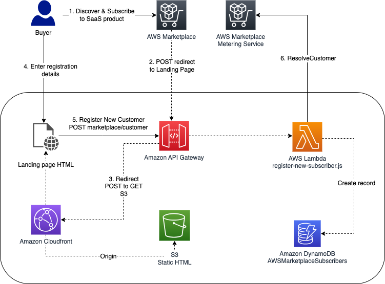
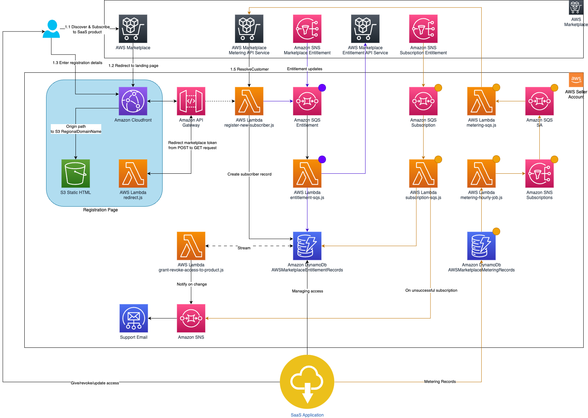

# AWS Marketplace Integration

## Overview

The AWS Marketplace integration with SBT consists of a set of CDK constructs that can accelerate the process of getting up and running with your SaaS listing on the AWS Marketplace. It provides a seamless integration between your SaaS product and the AWS Marketplace, enabling you to manage customer subscriptions, entitlements, and metering data.

## How does it work

When a buyer subscribes to the SaaS product listed in the AWS Marketplace, they are redirected to the fulfillment URL specified for that listing. Using the optional `SampleRegistrationWebPage`, you can create a customizable landing page that can be used to gather more information about the buyer (step 4). This information can then be stored (step 5) and used to inform downstream processes like resource provisioning as part of the onboarding workflow, for example. For a detailed demonstration of the AWS Marketplace integration in action, check out our [video walkthrough](https://www.youtube.com/watch?v=G0JeP4Gj9x0).




## Resources created

Based on the `pricingModel` selected, a different combination of the following resources will be created:



- If `pricingModel` is set to `AWSMarketplaceSaaSPricingModel.CONTRACTS_WITH_SUBSCRIPTION`, then all resources shown above will be created.
- If `pricingModel` is set to `AWSMarketplaceSaaSPricingModel.CONTRACTS`, then all resources except those marked with an orange circle will be created.
- If `pricingModel` is set to `AWSMarketplaceSaaSPricingModel.SUBSCRIPTIONS`, then all resources except those marked with a purple circle will be created.

### Key Resources

1. **Subscribers Table**: A DynamoDB table that stores information about the subscribers of your SaaS product, including their registration data and entitlement details.
2. **Entitlement Logic**: A set of resources that handle the entitlement notifications from AWS Marketplace. It includes an SQS queue, an SNS topic subscription, and a Lambda function that processes the entitlement notifications and stores the subscriber information in the Subscribers Table.
3. **Subscription Logic**: A set of resources that handle subscription-related events from AWS Marketplace. It includes a DynamoDB table for storing metering records, an SQS queue, and Lambda functions for processing metering data and sending it to AWS Marketplace.
4. **Registration API**: An API Gateway REST API that exposes endpoints for redirecting buyers to the registration page and creating new subscribers in the Subscribers Table.
5. **Registration Web Page**: An optional S3-hosted static website that provides a customizable registration page for buyers to submit their information. It is fronted by a CloudFront distribution for improved performance and security.

## Creating the Marketplace Constructs

The following CDK code shows how you can deploy the Marketplace integration along with SBT:

```typescript
// ...
import * as sbt from '@cdklabs/sbt-aws';
// ...

export class HelloCdkStack extends Stack {
  constructor(scope: Construct, id: string, props?: StackProps) {
    super(scope, id, props);

    const myControlPlane = new sbt.ControlPlane(this, 'myControlPlane', {
      systemAdminEmail: 'jane_doe@example.com',
    });

    // ...

    const myProduct = new sbt.AWSMarketplaceSaaSProduct(this, 'myProduct', {
      marketplaceTechAdminEmail: 'jane_doe@example.com',
      productCode: 'abcdef01234567890',
      entitlementSNSTopic: 'arn:aws:sns:us-east-1:111122223333:aws-mp-entitlement-notification-1234567890abcdef0',
      subscriptionSNSTopic: 'arn:aws:sns:us-east-1:111122223333:aws-mp-subscription-notification-021345abcdef6789',
      pricingModel: sbt.AWSMarketplaceSaaSPricingModel.CONTRACTS_WITH_SUBSCRIPTION,
      eventManager: myControlPlane.eventManager,
      requiredFieldsForRegistration: ['name', 'address', 'phone'],
    });

    new sbt.SampleRegistrationWebPage(this, 'S3BucketProductRegistrationWebPage', {
      registrationAPI: myProduct.registerCustomerAPI,
      userProvidedRequiredFieldsForRegistration: myProduct.userProvidedRequiredFieldsForRegistration,
    });
  }
}

// ...

const app = new cdk.App();
new HelloCdkStack(app, 'HelloCdkStack', {
  env: {
    // To use the Marketplace constructs, the region must be specified via environments at template synthesis
    // see here: https://docs.aws.amazon.com/cdk/v2/guide/configure-env.html#configure-env-when
    region: 'us-east-1', // Marketplace construct currently only supports the us-east-1 region
  }
});
```

Note: The following variables must be obtained from the SaaS listing created in the AWS Marketplace:

- `productCode`
- `entitlementSNSTopic`
- `subscriptionSNSTopic`

(For more information on input parameters, refer to the [documentation](https://constructs.dev/packages/@cdklabs/sbt-aws) on Construct Hub.)

## Interaction with SBT

Once the Marketplace construct is connected to an SBT control plane (via the optional `eventManager` input parameter of the `AWSMarketplaceSaaSProduct` construct), you will be able to integrate SBT operations with Marketplace buyer lifecycle events.

### Onboarding

When a buyer subscribes to your Marketplace listing and submits the fulfillment form, that information is combined with the entitlement information coming from Marketplace and used to create a `DetailType.ONBOARDING_REQUEST` event. This can then be used as a trigger for an onboarding job created as part of the `CoreApplicationPlane`.

### Offboarding

Similar to the onboarding event described above, a `DetailType.OFFBOARDING_REQUEST` event is emitted when a subscription expires. Just like the onboarding event, this event can also be used to trigger an offboarding job that perhaps cleans up the departing tenant's resources.

## Metering with AWS Marketplace

For pricing models that are usage based (i.e., `AWSMarketplaceSaaSPricingModel.CONTRACTS_WITH_SUBSCRIPTION` and `AWSMarketplaceSaaSPricingModel.SUBSCRIPTIONS`), you can send metered data to Marketplace by updating the Marketplace Metering Records table created by this integration.

The data to be inserted should be of the following format:

```json
{
  "create_timestamp": { "N": "<CURRENT_TIMESTAMP>" },
  "customerIdentifier": { "S": "<CUSTOMER_IDENTIFIER>" },
  "dimension_usage": {
    "L": [
      {
        "M": {
          "dimension": { "S": "<USAGE_DIMENSION_1>" },
          "value": { "N": "<USAGE_DIMENSION_1_VALUE>" }
        }
      }
    ]
  },
  "metering_pending": { "S": "true" }
}
```

where,

- `create_timestamp` is the Epoch time.
- `customerIdentifier` is the customer identifier provided by the AWS Marketplace. (This is stored in the Marketplace Subscribers table.)
- `dimension_usage` is a list of dimensions and the corresponding usage that you want Marketplace to record.

After inserting this data, you can either manually trigger the hourly Lambda function that sends the data to AWS Marketplace or wait for its automatic scheduled invocation. You can find this lambda by searching for a lambda with the keyword "Hourly" present in the name.

Once invoked, the lambda will flush that data to Marketplace. To see the result, go back to the entry you created in the Metering Records table. Once there, you should see that it has been updated to include the response from Marketplace as the metering record was submitted.

## Customization

The AWS Marketplace integration constructs provide several customization options to tailor the integration to your specific needs:

### Registration Page

When creating the `SampleRegistrationWebPage` construct, you can specify the following:

- `imageLogoUrl`: The URL of the image logo to display on the registration page.
- `userProvidedRequiredFieldsForRegistration`: Additional fields that buyers must provide during the registration process. These fields will be added to the registration form dynamically.

### Required Registration Fields

The `requiredFieldsForRegistration` property of the `AWSMarketplaceSaaSProduct` construct allows you to specify additional fields that buyers must provide during the registration process. These fields will be added to the registration form dynamically.

### Seller Email

If you want to send email notifications to buyers during the registration process, you can provide the `marketplaceSellerEmail` property when creating the `AWSMarketplaceSaaSProduct` construct. This email address must be verified in Amazon SES and in 'Production' mode.

## Conclusion

The AWS Marketplace integration with SBT provides a comprehensive set of constructs to streamline the process of listing and managing your SaaS product on the AWS Marketplace. By leveraging these constructs, you can handle customer subscriptions, entitlements, and metering data seamlessly, while also integrating with the SBT control plane for advanced onboarding and offboarding workflows.
